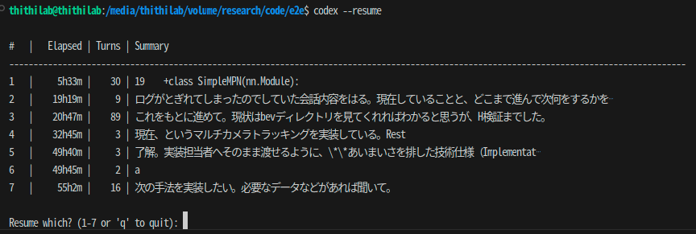

codex-resume （日本語）

English version is available: [README.en.md](README.en.md).



これは何？（一言で）

- Codex CLI に「履歴から再開」機能を足す、小さな追加ツールです。
- 使うコマンドはひとつだけ: `codex --resume`

`codex --resume` で何が起こる？

- いま開いているプロジェクト（Git の最上位／なければ現在のフォルダ）で、最近使った会話の一覧が出ます。
  - 表示: `# | Elapsed | Turns | Summary`
  - Summary は「最初のユーザ発話の先頭15文字」（環境ブロックやコードは除去）。ユーザ文が見つからないときは簡易要約を表示。
- 番号を入力すると、その会話の「続き」から Codex が開きます。
- 履歴はあなたの PC にある JSONL ログ（`~/.codex/sessions`）だけを読み取ります。外部にアップロードしません。
- 可能なら「当時の作業フォルダ（cwd）」で起動するので、相対パスのコマンドもそのまま通ります。

前提条件

- Codex CLI がインストール済みで、`codex` が PATH 上にある
- Node.js 18+（npx 実行に必要）

インストール（初回のみ）

```bash
npx codex-resume install
```

インストール直後に `codex` が見つからない／古い経路を指す場合は、新しいターミナルを開き直してください（または bash: `hash -r` / zsh: `rehash`）。

使い方

```bash
codex --resume
# 番号を入力でそのセッションを続きから再開、q で終了
```

コマンドの説明

- `codex --resume`
  - 現在のプロジェクト直近の会話を一覧表示し、番号で選んで再開します。
  - 一覧はローカルのログから作られます（ネット送信なし）。

アンインストール

```bash
rm ~/.local/bin/codex
```

アンインストール直後は、新しいターミナルを開き直すと解決が早いです（または bash: `hash -r` / zsh: `rehash`）。

トラブルシュート

- `codex not found`: Codex CLI をインストールし PATH に通してください。`CODEX_REAL=/abs/path/to/codex` を設定して使うこともできます。
- “No sessions …”: このプロジェクト直下で一度 Codex を起動して1行やり取りし、`~/.codex/sessions` に JSONL を生成してください。同一ルートのログのみが表示対象です。
- 表示のズレ: 出力は `|` 区切り＋数値列右寄せで安定表示にしています。
- シェルのハッシュ（キャッシュ）: インストール/アンインストール直後に `codex` が古いパスのまま/見つからない場合、シェルのコマンドハッシュをクリアしてください。
  - bash: `hash -d codex 2>/dev/null; hash -r`
  - zsh: `rehash`
  - もしくは新しいターミナルを開く。`type -a codex` で解決順を確認できます。

注意

- `experimental_resume` は実験的キーのため、将来挙動が変わる可能性があります。
- このラッパは `--resume` 以外の引数は本家 `codex` にそのまま渡します。

experimental_resume について（重要）

- 何をするか: 会話ログ（JSONL）の内容を読み込み、過去の user/assistant メッセージを初期履歴として「プリロード」します。これにより前回の続きから会話できます。
- 共有しない/含まれないもの: 実行中のプロセスや端末の状態、環境変数のスナップショット、開いていたエディタの状態、作業中の一時ファイル、ローカルのファイルツリー全体などは復元・共有されません。いわゆる“コンテキスト共有”やプロジェクトの自動アップロードは行いません。
- CWD の扱い: `cwd` はこのラッパ（シム）が JSONL から推定して `spawn(..., { cwd })` で反映します（Codex 本体が VM を復元するわけではありません）。
- reasoning の要約: `type:"reasoning"` の `summary[].text` は UI/ログ向けであり、モデルに送る通常の“メッセージ”としては扱われません。
- プライバシー: 本 CLI は JSONL の「パス」を Codex に渡すだけで、ログを独自に送信しません。以降の送受信は Codex の通常設定（選択したモデル/プロバイダ）に従います。
